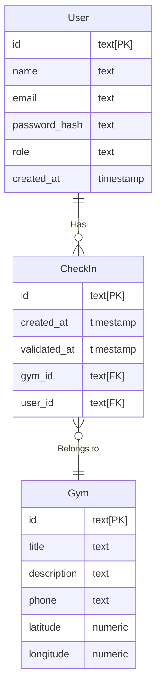

<h1 align="center">
  
</h1>

<p align="center">
  
  
  
  
  
  
  
  
  
  
</p>

## 💻 Projeto

  Esse projeto é uma API REST, inspirada no GymPass, nessa API temos serviços como:
  - Cadastrar;
  - Autenticar;
  - Cadastrar uma academia;
  - Procurar academias por nome;
  - Procurar academias próximas em um raio de 10km;
  - Fazer check-in em uma academia;
  - Validar o check-in de um cliente;
  - Verificar seu histórico de check-ins;
  - Verificar suas métricas;
  - Recuperar suas informações de perfil;

## 🤌 Patterns

<details>
  <summary><strong>Repository</strong></summary><br />

  > O Repository Pattern é um padrão de projeto de software que promove a separação de preocupações entre a lógica de negócios e o acesso a dados. Ele introduz uma camada de abstração, geralmente na forma de interfaces ou classes abstratas, para operações de persistência, como criação, leitura, atualização e exclusão (CRUD). Isso isola o código de negócios de implementações específicas de armazenamento de dados, facilitando a reutilização, manutenção e testabilidade do código. O padrão oferece flexibilidade ao permitir a troca da fonte de dados sem afetar a lógica de negócios. Em resumo, o Repository Pattern promove uma arquitetura mais organizada e modularizada em aplicações.
</details>

<details>
  <summary><strong>Factory</strong></summary><br />

  > O Factory Pattern é um padrão de projeto que fornece uma interface para criar objetos em uma superclasse, mas permite que as subclasses alterem o tipo de objetos que serão criados. Ele abstrai o processo de instanciação, proporcionando flexibilidade na criação de objetos e promovendo o princípio da programação para interfaces. O Factory Pattern é útil quando a criação de objetos envolve lógica complexa ou quando é necessário desacoplar o código cliente da implementação específica das classes concretas. Em resumo, esse padrão oferece uma maneira de criar objetos de forma flexível e extensível.
</details>
  
<details>
  <summary><strong>Dependency Injection</strong></summary><br />

  > O Dependency Injection Pattern é uma abordagem de design em que as dependências de uma classe são injetadas externamente, em vez de serem criadas internamente. Isso promove a flexibilidade e a reusabilidade do código, facilitando a troca de implementações de dependências sem modificar o código cliente. O padrão ajuda a melhorar a testabilidade, facilitando a introdução de substitutos (mocks) durante os testes unitários. Em essência, o Dependency Injection reduz o acoplamento entre as classes, promovendo um código mais modular e fácil de manter.
</details>

<details>
  <summary><strong>Middleware</strong></summary><br />

  > O Middleware Pattern é um design pattern utilizado para processar solicitações ou mensagens em um sistema de software em vários estágios durante sua execução. Em uma aplicação web, os middlewares são componentes modulares que desempenham funções específicas, como autenticação, autorização, manipulação de solicitações e respostas, entre outras. Cada middleware na cadeia é capaz de modificar ou complementar o comportamento da solicitação. Esse padrão proporciona flexibilidade ao permitir a fácil inclusão, remoção ou modificação de funcionalidades, sem afetar diretamente o núcleo da aplicação. Os middlewares são frequentemente empregados em frameworks e bibliotecas web, oferecendo uma abordagem extensível para lidar com diferentes aspectos do processamento de requisições em uma aplicação.
</details>

<details>
  <summary><strong>Error Handling</strong></summary><br />

  > O Error Handling Pattern é um design pattern que estabelece práticas para gerenciar erros e exceções de forma consistente em um sistema de software. Ele visa melhorar a robustez, identificação rápida de problemas e manutenção eficiente. No contexto do código fornecido, o uso do setErrorHandler no arquivo server.ts exemplifica a implementação desse padrão, fornecendo um manipulador global para tratar e responder a diferentes tipos de erros de maneira organizada, melhorando a experiência do usuário e facilitando a depuração.
</details>

## 🔐 Autenticação

O sistema de autenticação utiliza __JSON Web Tokens__ `JWT` para autenticar usuários. Quando um usuário fornece credenciais válidas em `/sessions`, __o sistema gera um token JWT de acesso__ e um __token de atualização (refresh token)__. __O token JWT é utilizado para autenticar solicitações subsequentes__, enquanto o __refresh token é armazenado como um `cookie` chamado refreshToken__.

O middleware `verifyJWT` é empregado em rotas específicas, como `/me`, para __garantir a autenticidade do token JWT__. Além disso, há uma rota `/token/refresh` que __renova o token de acesso usando o refresh token armazenado no cookie__. Isso contribui para a _segurança_ e a _manutenção da sessão do usuário_.

### Role-Based Access Control (RBAC)

No sistema de __Role-Based Access Control `RBAC`__, as __permissões são atribuídas aos usuários com base em suas funções (roles)__. O sistema utiliza essa função como __middleware para verificar se o usuário autenticado possui a função necessária para acessar determinados recursos__. No caso, o RBAC verifica se o papel (role) do usuário corresponde à função que está sendo verificada. Se não corresponder, a resposta é uma negação de acesso (código 401), indicando "Não Autorizado". __Isso fortalece a segurança, controlando de maneira granular o acesso a diferentes partes do sistema com base nas funções atribuídas aos usuários__.

## 🎲 Persistencia dos dados

Para persistência de dados, o sistema utiliza `PostgreSQL`, sendo orquestrado por meio de um contêiner `Docker` gerenciado pelo `Docker Compose`. Essa abordagem oferece __portabilidade e facilidade na implantação do ambiente de desenvolvimento__.

O `Prisma` é adotado como __`ORM` (Object-Relational Mapping)__ para __definir e manipular os esquemas do banco de dados__. Ele __simplifica a interação com o PostgreSQL__, permitindo a criação de consultas e operações de banco de dados de maneira __eficiente e intuitiva__. Essa escolha de tecnologias reflete uma __arquitetura moderna e escalável__ para garantir a __robustez e a manutenibilidade da camada de persistência do sistema__.

## 🧪 Testes

O sistema passou por rigorosos testes para __garantir a qualidade e robustez do código__. No contexto dos __testes unitários__, adotamos a metodologia __Test-Driven Development `TDD`__, concentrando-nos na avaliação das __camadas mais internas__, em particular nos __casos de uso__. A utilização do `supertest` é fundamental para simular __solicitações HTTP__, proporcionando uma __análise precisa do comportamento do sistema__ em um ambiente semelhante ao de __produção__. Além disso, para a execução dos __testes end-to-end `e2e`__, que abrangem desde as __solicitações HTTP__ até a __persistência de dados no banco de dados__, é necessário configurar um ambiente específico. Isso inclui a criação de um __novo schema no banco de dados__, que é __descartado após a conclusão__ dos testes. Todas essas configurações foram implementadas com cuidado no sistema utilizando `vitest`.

## 🕵️ Modelagem lógica



## 🤔 Levantamento de requisitos

### Requisitos funcionais

```bash
✅ Deve ser possível se cadastrar;
✅ Deve ser possível se autenticar;
✅ Deve ser possível obter o perfil de um usuário logado;
✅ Deve ser possível obter o número de check-ins realizados pelo usuário logado;
✅ Deve ser possível o usuário obter seu histórico de check-ins;
✅ Deve ser possível o usuário buscar academias próximas (10km);
✅ Deve ser possível o usuário buscar academia pelo nome;
✅ Deve ser possível o usuário realizar check-in em uma academia;
✅ Deve ser possível validar o check-in de um usuário;
✅ Deve ser possível cadastrar uma academia;
```

### Regras de negócio

```bash
✅ O usuário não deve poder se cadastrar com um e-mail duplicado;
✅ O usuário não pode fazer 2 check-ins no mesmo dia;
✅ O usuário não pode fazer check-in se não estiver perto (100m) da academia;
✅ O check-in só pode ser validado até 20 minutos após criado;
✅ O check-in só pode ser validado por administradores;
✅ A academia só pode ser cadastrada por administradores;
```


### Requisitos não-funcionais

```bash
✅ A senha do usuário precisa estar criptografada;
✅ Os dados da aplicação precisam estar persistidos em um banco PostgreSQL;
✅ Todas listas de dados precisam estar paginadas com 20 itens por página;
✅ O usuário deve ser identificado por um JWT;
```

## ✍️ Instrução

### Pré configuração.
>Para executar esse projeto será necessário ter o [node](https://nodejs.org/en) instalado, de a preferência para a versão apresentada na tag do início desse readme.
>
>Para conseguir transitar bem entre as versões sugiro o uso do [nvm](https://github.com/nvm-sh/nvm)
>
>Para criar um container com o banco de dados será necessário ter o [docker](https://docs.docker.com/engine/install/) e [docker compose](https://docs.docker.com/compose/install/) instalados.

### Configuração
>Após acessar o diretório do projeto, crie seu arquivo `.env` na raiz do projeto seguindo o arquivo `.env.example`, leve em consideração as informações do campo `environment` do `docker-compose` para substituir `${username}`, `${password}` e `${databaseName}`.

Com o docker rodando em sua maquina e com o projeto aberto, abra seu terminal e execute os seguintes passos:
```bash
# Instalação dos pacotes
$ npm install

# Execução das migrations
$ npx prisma migrate dev

# Execução do servidor
$ npm run dev

# Execução dos testes unitários
$ npm run test

# Execução dos testes e2e
$ npm run e2e

# Execução da cobertura dos testes
$ npm run coverage
```

Você pode está utilizando ferramentas como [insomnia](https://insomnia.rest/download), [postman](https://www.postman.com/downloads/) e [apidog](https://apidog.com/download/) para realizar as requisições.

Para acompanhar os registros no banco de dados execute `npx prisma studio`.
